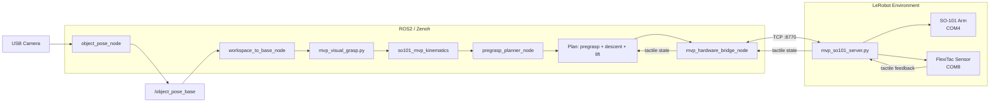

# SO-101 Visual-Tactile Grasp

[English](README.md) | [简体中文](README_zh-CN.md)

A ROS2-based visual-tactile grasping system for the SO-101 robot arm, integrating vision-based object localization, kinematics-based grasp planning, real-robot control, and FlexiTac tactile contact feedback.

---

## Final Result

**Final Hardware Acceptance: PASS**

The end-to-end visual-tactile grasp-and-lift pipeline has been validated on real hardware:

> Visual pose → +20 mm forward X correction → 5-joint IK → pregrasp → 7-segment descent → incremental gripper closing → tactile contact stop → 3-segment lift

All core behaviors are frozen and verified.

*Demo media can be added here.*

---

## Features

- **ArUco-based object localization** — single-block detection with camera-to-base coordinate transform
- **Full 5-joint inverse kinematics** — damped least-squares IK with multiseed fallback
- **Pregrasp + segmented Cartesian descent** — 7-waypoint descent from approach pose
- **FlexiTac direct serial integration** — 12×32 tactile array via COM8 at 2 Mbaud
- **Incremental close-until-contact gripper control** — tactile frame scoring with confirm/release hysteresis
- **Contact-gated lift** — lift only proceeds if tactile contact is confirmed; aborts on contact loss
- **ROS2 / Zenoh hardware communication** — `rmw_zenoh_cpp` middleware
- **LeRobot TCP bridge** — single-client JSON-lines protocol over localhost:8770
- **Explicit plan-only safety mode** — full perception/planning validation before any motion
- **Manual confirmation before real motion** — `--confirm VISUAL_GRASP` required for execute
- **Real-robot X-axis grasp calibration offset** — +20 mm forward empirical correction
- **Multi-terminal hardware workflow** — independent terminal windows with visual readiness checks

---

## System Architecture



### TCP Ownership

| Component | Role | Notes |
|-----------|------|-------|
| `mvp_so101_server.py` | **TCP server** (sole owner) | Listens on 127.0.0.1:8770, single client |
| `mvp_hardware_bridge_node` | **TCP client** (sole persistent client) | Polls state, forwards targets |
| `mvp_visual_grasp.py` | **No TCP socket** | Communicates via ROS2 topics/services only |

---

## Final Grasp Pipeline

1. **Detect object** — ArUco marker pose in workspace coordinates
2. **Transform** — workspace → base_link via calibrated transform
3. **Apply correction** — +20 mm forward X offset (empirical per validated setup)
4. **Solve IK** — 5-joint target for pregrasp pose (damped least-squares)
5. **Plan pregrasp** — approach pose above object
6. **Execute descent** — 7 Cartesian waypoints, 7 cm total descent
7. **Close gripper incrementally** — step 2.0, tactile check each step
8. **Stop on tactile contact** — primary termination; safe limit (5.0) as secondary
9. **Lift** — 3 segments (+10 / +20 / +30 mm), only if contact confirmed
10. **Abort lift** — if tactile contact lost during lift

---

## Hardware

| Component | Details |
|-----------|---------|
| **Robot Arm** | SO-101 6-DOF follower (shoulder_pan, shoulder_lift, elbow_flex, wrist_flex, wrist_roll, gripper) |
| **Tactile Sensor** | FlexiTac 12×32 tactile array |
| **Camera** | USB camera (top-down view) |
| **Workstation** | Windows (validated platform) |

---

## Software Stack

| Layer | Technology |
|-------|------------|
| **Language** | Python |
| **Robotics Middleware** | ROS2 Lyrical (`rmw_zenoh_cpp`) |
| **Robot Driver** | LeRobot (SO-101 hardware interface) |
| **Vision** | OpenCV (ArUco marker detection) |
| **Kinematics** | NumPy (custom damped least-squares IK) |
| **Tactile** | FlexiTac direct serial reader |
| **Communication** | TCP JSON-lines (localhost:8770) |
| **Environment** | Conda (LeRobot) + Pixi (ROS2 Lyrical) |

---

## Repository Structure

```
so101_visual_tactile_grasp/
├── config/                     # Frozen configuration files
│   └── mvp_hardware.json       # Primary config (COM ports, tactile, speeds, offsets)
├── scripts/                    # Entry scripts and verification suite
│   ├── mvp_so101_server.py     # LeRobot TCP hardware server
│   ├── mvp_visual_grasp.py     # Integrated visual-tactile grasp planner
│   └── open_mvp4e_terminals.ps1  # Multi-terminal opener (official)
├── ros2_ws/src/                # ROS2 packages
│   ├── so101_mvp_kinematics/   # FK, IK, Jacobian, joint limits
│   ├── so101_mvp_control/      # Bridge node, TCP client, grasp controller
│   ├── so101_mvp_bringup/      # Launch files
│   ├── so101_object_perception/# ArUco object pose detection
│   └── so101_frame_transform/  # Workspace-to-base coordinate transform
├── lerobot_server/             # LeRobot hardware abstraction layer
├── shared_protocol/            # TCP client library and protocol spec
├── audit/                      # Environment audit and ROS2 runtime helpers
├── docs/                       # Documentation
│   ├── ARCHITECTURE.md         # Detailed architecture
│   ├── FINAL_ACCEPTANCE.md     # Final hardware acceptance guide
│   ├── TROUBLESHOOTING.md      # Common issues and solutions
│   └── VERIFICATION.md         # Verification summary
├── data/
│   ├── calibration/            # Camera intrinsics, workspace calibration
│   ├── robot_model/            # Frozen SO-101 URDF + CAD assets
│   └── verification/           # Verification evidence (final + archive)
├── tests/                      # Protocol contract tests
├── README.md                   # You are here
└── README_zh-CN.md             # 简体中文版本
```

---

## Setup

### Prerequisites

- **Windows** is the validated development/runtime platform
- **LeRobot Conda environment** — provides the SO-101 hardware interface and FlexiTac reader
- **ROS2 Lyrical** (via Pixi) — provides `rclpy`, `rmw_zenoh_cpp`, and colcon build tools

### Environment

```powershell
# LeRobot environment (Conda)
conda activate lerobot

# ROS2 Lyrical environment (Pixi)
# Use audit/run_in_ros2_lyrical.ps1 to wrap all ROS2 commands
```

See `docs/FINAL_ACCEPTANCE.md` for the complete environment setup and validation steps.

### Build

```powershell
# Build required ROS2 packages
& ".\audit\run_in_ros2_lyrical.ps1" -Command `
  "cd /d <PROJECT_ROOT>\ros2_ws && colcon build --merge-install --packages-select so101_mvp_control so101_mvp_bringup so101_mvp_kinematics so101_object_perception so101_frame_transform"
```

---

## Configuration

Primary configuration file: `config/mvp_hardware.json`

### Key Parameters

| Field | Default | Description |
|-------|---------|-------------|
| `follower_port` | `COM4` | SO-101 robot serial port |
| `tactile.port` | `COM8` | FlexiTac serial port |
| `tactile.baudrate` | `2000000` | FlexiTac baud rate |
| `grasp_x_offset_m` | `+0.020` | Forward grasp correction (+X = forward) |
| `control_rate_hz` | `20.0` | Motion control rate |
| `first_test_speed_rad_s` | `0.06` | Default arm speed |
| `maximum_speed_rad_s` | `0.08` | Maximum arm speed |
| `gripper_close_step_per_tick` | `0.5` | Server-side gripper step |

**X Offset Note:** `+0.020 m` is an empirical correction for the validated setup. In this setup, `+X` points forward / away from the robot base. This is a per-setup calibration value, not a universal SO-101 parameter.

---

## Running

### Official Workflow: Multi-Terminal Manual

The **only supported** workflow for final acceptance is the manual multi-terminal approach.

#### Quick Start

```powershell
powershell -ExecutionPolicy Bypass -File .\scripts\open_mvp4e_terminals.ps1
```

This opens 4 independent PowerShell windows:

| Terminal | What Runs |
|----------|-----------|
| **0 — Zenoh** | Zenoh router (`rmw_zenohd`) |
| **1 — Server** | LeRobot server (COM4 robot + COM8 FlexiTac + TCP server) |
| **2 — Bridge** | ROS2 hardware bridge (sole TCP client) |
| **3 — Vision** | Visual perception / pregrasp preview nodes |

The script only opens windows. It does **not** verify readiness, parse logs, or manage processes.

#### Verify Readiness

Check each terminal by eye before proceeding:

- **Terminal 0**: Zenoh router started normally
- **Terminal 1**: `TACTILE_SERIAL_OPENED port=COM8`, `TACTILE_BASELINE_COMPLETED`, `TACTILE_READY true`, `ROBOT_CONNECTED port=COM4`, `TCP_SERVER_LISTENING`
- **Terminal 2**: `BRIDGE_TCP_CONNECTED`, `BRIDGE_TCP_READY true`
- **Terminal 3**: Object pose publishing, no errors

#### Plan-Only

Run first to validate perception, kinematics, and trajectory without any hardware motion:

```powershell
& ".\audit\run_in_ros2_lyrical.ps1" -Command `
  "cd /d <PROJECT_ROOT>\ros2_ws && call install\local_setup.bat && cd /d <PROJECT_ROOT> && python scripts\mvp_visual_grasp.py --plan-only"
```

Expected output:
- `success=true`
- `waypoint_count=7`
- `lift_waypoint_count=3`
- `hardware_command_sent=false`

**If plan-only fails, stop. Do not proceed.**

#### Execute

Only after plan-only PASS. Keep the object and camera stationary.

```powershell
& ".\audit\run_in_ros2_lyrical.ps1" -Command `
  "cd /d <PROJECT_ROOT>\ros2_ws && call install\local_setup.bat && cd /d <PROJECT_ROOT> && python scripts\mvp_visual_grasp.py --execute --confirm VISUAL_GRASP"
```

You must type the `--confirm VISUAL_GRASP` flag — no script will type it for you.

#### Optional: Tactile Test

Test tactile sensor reading before the full grasp:

```powershell
& ".\audit\run_in_ros2_lyrical.ps1" -Command `
  "cd /d <PROJECT_ROOT>\ros2_ws && call install\local_setup.bat && cd /d <PROJECT_ROOT> && python scripts\mvp_visual_grasp.py --tactile-test"
```

#### Shutdown

1. Wait for action to finish
2. Terminal 3 (Vision) → Ctrl+C
3. Terminal 2 (Bridge) → Ctrl+C
4. Terminal 1 (Server) → Ctrl+C
5. Terminal 0 (Zenoh) → Ctrl+C
6. Robot follower power off

---

## Safety — Real Robot Notes

- **Keep physical power cutoff accessible** at all times.
- **Verify calibration and object placement** before each execute.
- **Always run plan-only first.** Never skip to execute.
- **Do not move camera or object** between plan-only and execute.
- **Stop the robot physically** if unexpected motion occurs.
- **No automatic retry** is performed after ambiguous motion or disconnection.
- **Lift requires confirmed tactile contact.** If no contact is detected, the arm will not lift.

---

## Final Acceptance

**Final Hardware Acceptance: PASS**

| Stage | Result |
|-------|--------|
| Vision (ArUco pose) | PASS |
| 5-joint IK | PASS |
| Pregrasp motion | PASS |
| 7-segment descent | PASS |
| Incremental tactile-guided closing | PASS |
| Tactile contact stop | PASS |
| 3-segment lift | PASS |
| +20 mm forward X compensation | PASS |
| Plan-only safety gate | PASS |
| End-to-end grasp-and-lift | PASS |

The final manual hardware acceptance successfully completed the full visual-tactile grasp-and-lift pipeline on the SO-101 robot.

See `docs/FINAL_ACCEPTANCE.md` for the complete acceptance guide and `data/verification/final/` for verification evidence.

---

## Known Scope & Limitations

The current MVP focuses on **single-object tabletop grasp-and-lift** with a fixed camera setup and ArUco-assisted localization.

**Current scope includes:**
- Single known object on a tabletop
- Fixed top-down camera
- ArUco marker-based object identification
- Single SO-101 robot arm
- Manual multi-terminal startup
- Manual confirmation before each motion

**Current scope does not include:**
- Automatic retry, return, or placement
- General object detection (no markerless vision)
- SLAM or navigation
- Multi-object scenes
- Dynamic object tracking
- Obstacle avoidance
- Multi-robot coordination

These are intentional scope boundaries, not bugs.

---

## Documentation Index

| Document | Description |
|----------|-------------|
| [README_zh-CN.md](README_zh-CN.md) | 简体中文版本 |
| [ARCHITECTURE.md](docs/ARCHITECTURE.md) | Detailed system architecture |
| [FINAL_ACCEPTANCE.md](docs/FINAL_ACCEPTANCE.md) | Final hardware acceptance guide |
| [TROUBLESHOOTING.md](docs/TROUBLESHOOTING.md) | Common issues and solutions |
| [VERIFICATION.md](docs/VERIFICATION.md) | Verification summary and evidence |
| [data/verification/README.md](data/verification/README.md) | Verification evidence index |

---

## License

This project is provided as engineering reference. See individual components for applicable licenses (LeRobot, ROS2, OpenCV, etc.).
