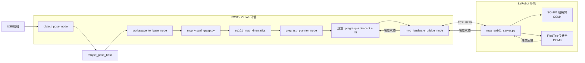

# SO-101 视觉-触觉抓取系统

[English](README.md) | [简体中文](README_zh-CN.md)

基于ROS2的SO-101机械臂视觉-触觉抓取系统，集成视觉定位、运动学规划、真机控制和FlexiTac触觉反馈。

---

## 最终结果

**最终真机验收：PASS**

完整端到端视觉-触觉抓取-抬升链路已在真机上验证通过：

> 视觉定位 → +20 mm X轴前向补偿 → 5关节逆运动学 → 预抓取 → 7段下降 → 增量夹爪闭合 → 触觉接触停止 → 3段抬升

所有核心行为已冻结并验证。

*可在此处添加演示视频/图片。*

---

## 功能特性

- **ArUco物体定位** — 单一物块检测，相机坐标到基座坐标变换
- **完整5关节逆运动学** — 阻尼最小二乘法IK，多种子点回退
- **预抓取 + 分段笛卡尔下降** — 7个路径点从预抓取位姿下降7 cm
- **FlexiTac直连串口集成** — 12×32触觉阵列，COM8，2 Mbaud
- **增量式夹取-到-接触控制** — 触觉帧差分评分，确认/释放迟滞
- **接触门控抬升** — 仅在触觉接触确认后才执行抬升；接触丢失即中止
- **ROS2 / Zenoh通信** — `rmw_zenoh_cpp` 中间件
- **LeRobot TCP桥接** — 单客户端JSON-lines协议，localhost:8770
- **显式plan-only安全模式** — 任何运动前先完成感知/规划的完整验证
- **真机运动前人工确认** — `--confirm VISUAL_GRASP` 为强制执行的前置条件
- **真机X轴抓取标定补偿** — +20 mm前向经验校正
- **多终端手动工作流** — 独立终端窗口，目视确认就绪状态

---

## 系统架构



### TCP所有权

| 组件 | 角色 | 说明 |
|------|------|------|
| `mvp_so101_server.py` | **TCP服务器**（唯一） | 监听 127.0.0.1:8770，单客户端 |
| `mvp_hardware_bridge_node` | **TCP客户端**（唯一常驻） | 轮询状态，转发目标指令 |
| `mvp_visual_grasp.py` | **无TCP连接** | 仅通过ROS2主题/服务通信 |

---

## 最终抓取管线

1. **检测物体** — ArUco标记在工作空间坐标系中的位姿
2. **坐标变换** — 工作空间 → base_link（标定变换矩阵）
3. **施加校正** — +20 mm X轴前向偏移（针对当前验证设置的经验值）
4. **求解IK** — 预抓取位姿的5关节目标（阻尼最小二乘法）
5. **规划预抓取** — 物体上方的接近位姿
6. **执行下降** — 7个笛卡尔路径点，总下降7 cm
7. **增量闭合夹爪** — 步长2.0，每步检测触觉
8. **触觉接触停止** — 主要终止条件；安全限位（5.0）为备用终止
9. **抬升** — 3段（+10 / +20 / +30 mm），仅在接触确认后执行
10. **抬升中止** — 若抬升过程中触觉接触丢失，立即中止

---

## 硬件

| 组件 | 详情 |
|------|------|
| **机械臂** | SO-101 6-DOF Follower（shoulder_pan, shoulder_lift, elbow_flex, wrist_flex, wrist_roll, gripper） |
| **触觉传感器** | FlexiTac 12×32触觉阵列 |
| **相机** | USB相机（顶视） |
| **工作站** | Windows（已验证平台） |

---

## 软件栈

| 层 | 技术 |
|----|------|
| **语言** | Python |
| **机器人中间件** | ROS2 Lyrical（`rmw_zenoh_cpp`） |
| **机器人驱动** | LeRobot（SO-101硬件接口） |
| **视觉** | OpenCV（ArUco标记检测） |
| **运动学** | NumPy（自定义阻尼最小二乘IK） |
| **触觉** | FlexiTac直连串口读取 |
| **通信** | TCP JSON-lines（localhost:8770） |
| **环境** | Conda（LeRobot）+ Pixi（ROS2 Lyrical） |

---

## 仓库结构

```
so101_visual_tactile_grasp/
├── config/                     # 冻结的配置文件
│   └── mvp_hardware.json       # 主配置（串口、触觉、速度、偏移）
├── scripts/                    # 入口脚本和验证套件
│   ├── mvp_so101_server.py     # LeRobot TCP硬件服务器
│   ├── mvp_visual_grasp.py     # 集成视觉-触觉抓取规划器
│   └── open_mvp4e_terminals.ps1  # 多终端启动器（正式入口）
├── ros2_ws/src/                # ROS2包
│   ├── so101_mvp_kinematics/   # 正/逆运动学、雅可比、关节限位
│   ├── so101_mvp_control/      # 桥接节点、TCP客户端、抓取控制器
│   ├── so101_mvp_bringup/      # 启动文件
│   ├── so101_object_perception/# ArUco物体位姿检测
│   └── so101_frame_transform/  # 工作空间到基座坐标变换
├── lerobot_server/             # LeRobot硬件抽象层
├── shared_protocol/            # TCP客户端库和协议规范
├── audit/                      # 环境审计和ROS2运行时辅助工具
├── docs/                       # 文档
│   ├── ARCHITECTURE.md         # 详细架构说明
│   ├── FINAL_ACCEPTANCE.md     # 最终真机验收指南
│   ├── TROUBLESHOOTING.md      # 常见问题排查
│   └── VERIFICATION.md         # 验证总结
├── data/
│   ├── calibration/            # 相机内参、工作空间标定
│   ├── robot_model/            # 冻结的SO-101 URDF + CAD模型
│   └── verification/           # 验证证据（最终 + 归档）
├── tests/                      # 协议合约测试
├── README.md                   # 英文版本
└── README_zh-CN.md             # 你正在阅读本文件
```

---

## 环境搭建

### 前置条件

- **Windows** 为已验证的开发/运行平台
- **LeRobot Conda环境** — 提供SO-101硬件接口和FlexiTac读取器
- **ROS2 Lyrical**（通过Pixi安装）— 提供 `rclpy`、`rmw_zenoh_cpp` 和colcon构建工具

### 环境

```powershell
# LeRobot环境（Conda）
conda activate lerobot

# ROS2 Lyrical环境（Pixi）
# 使用 audit/run_in_ros2_lyrical.ps1 包装所有ROS2命令
```

详见 `docs/FINAL_ACCEPTANCE.md` 获取完整的环境搭建和验证步骤。

### 构建

```powershell
# 构建所需的ROS2包
& ".\audit\run_in_ros2_lyrical.ps1" -Command `
  "cd /d <PROJECT_ROOT>\ros2_ws && colcon build --merge-install --packages-select so101_mvp_control so101_mvp_bringup so101_mvp_kinematics so101_object_perception so101_frame_transform"
```

---

## 配置

主配置文件：`config/mvp_hardware.json`

### 关键参数

| 字段 | 默认值 | 说明 |
|------|--------|------|
| `follower_port` | `COM4` | SO-101机械臂串口 |
| `tactile.port` | `COM8` | FlexiTac串口 |
| `tactile.baudrate` | `2000000` | FlexiTac波特率 |
| `grasp_x_offset_m` | `+0.020` | 前向抓取校正（+X = 向前） |
| `control_rate_hz` | `20.0` | 运动控制频率 |
| `first_test_speed_rad_s` | `0.06` | 默认机械臂速度 |
| `maximum_speed_rad_s` | `0.08` | 最大机械臂速度 |
| `gripper_close_step_per_tick` | `0.5` | 服务端夹爪步长 |

**X偏移说明：** `+0.020 m` 是针对当前验证设置的经验校正值。在本设置中，`+X` 指向前方/远离机器人基座。此为按需调整的标定值，并非SO-101的通用参数。

---

## 运行

### 正式流程：多终端手动操作

**唯一支持**的最终验收方式是手动多终端流程。

#### 快速启动

```powershell
powershell -ExecutionPolicy Bypass -File .\scripts\open_mvp4e_terminals.ps1
```

此命令打开4个独立的PowerShell窗口：

| 终端 | 运行内容 |
|------|----------|
| **0 — Zenoh** | Zenoh路由器（`rmw_zenohd`） |
| **1 — Server** | LeRobot服务器（COM4机械臂 + COM8 FlexiTac + TCP服务器） |
| **2 — Bridge** | ROS2硬件桥接（唯一TCP客户端） |
| **3 — Vision** | 视觉感知 / 预抓取预览节点 |

该脚本仅打开窗口，**不**验证就绪状态、不解析日志、不管理进程。

#### 验证就绪状态

在继续之前，逐一目视检查每个终端：

- **终端0**：Zenoh路由器正常启动
- **终端1**：`TACTILE_SERIAL_OPENED port=COM8`，`TACTILE_BASELINE_COMPLETED`，`TACTILE_READY true`，`ROBOT_CONNECTED port=COM4`，`TCP_SERVER_LISTENING`
- **终端2**：`BRIDGE_TCP_CONNECTED`，`BRIDGE_TCP_READY true`
- **终端3**：物体位姿正在发布，无错误

#### Plan-Only（仅规划）

在任何硬件运动之前，先运行plan-only验证感知、运动学和轨迹：

```powershell
& ".\audit\run_in_ros2_lyrical.ps1" -Command `
  "cd /d <PROJECT_ROOT>\ros2_ws && call install\local_setup.bat && cd /d <PROJECT_ROOT> && python scripts\mvp_visual_grasp.py --plan-only"
```

预期输出：
- `success=true`
- `waypoint_count=7`
- `lift_waypoint_count=3`
- `hardware_command_sent=false`

**若plan-only失败，停止操作，不要继续。**

#### 执行

仅在plan-only通过后执行。保持物体和相机不动。

```powershell
& ".\audit\run_in_ros2_lyrical.ps1" -Command `
  "cd /d <PROJECT_ROOT>\ros2_ws && call install\local_setup.bat && cd /d <PROJECT_ROOT> && python scripts\mvp_visual_grasp.py --execute --confirm VISUAL_GRASP"
```

`--confirm VISUAL_GRASP` 必须手动输入——不会有脚替代你输入。

#### 可选：触觉测试

在完整抓取之前测试触觉传感器：

```powershell
& ".\audit\run_in_ros2_lyrical.ps1" -Command `
  "cd /d <PROJECT_ROOT>\ros2_ws && call install\local_setup.bat && cd /d <PROJECT_ROOT> && python scripts\mvp_visual_grasp.py --tactile-test"
```

#### 关闭顺序

1. 等待动作完成
2. 终端3（Vision）→ Ctrl+C
3. 终端2（Bridge）→ Ctrl+C
4. 终端1（Server）→ Ctrl+C
5. 终端0（Zenoh）→ Ctrl+C
6. 机械臂Follower断电

---

## 安全 — 真机操作须知

- **物理急停开关必须随时可触及。**
- **每次执行前验证标定和物体位置。**
- **始终先运行plan-only。** 绝不要直接跳至execute。
- **plan-only与execute之间不要移动相机或物体。**
- **发生异常运动时立即物理停止机器人。**
- **发生异常动作或断开连接后不会自动重试。**
- **抬升需要已确认的触觉接触。** 若未检测到接触，机械臂不执行抬升。

---

## 最终验收

**最终真机验收：PASS**

| 阶段 | 结果 |
|------|------|
| 视觉（ArUco位姿） | PASS |
| 5关节逆运动学 | PASS |
| 预抓取运动 | PASS |
| 7段下降 | PASS |
| 增量触觉引导夹取 | PASS |
| 触觉接触停止 | PASS |
| 3段抬升 | PASS |
| +20 mm X轴前向补偿 | PASS |
| Plan-only安全门控 | PASS |
| 端到端抓取-抬升 | PASS |

最终手动真机验收成功完成了SO-101机械臂上完整的视觉-触觉抓取-抬升管线。

详见 `docs/FINAL_ACCEPTANCE.md` 获取完整的验收指南，`data/verification/final/` 获取验证证据。

---

## 已知范围与限制

当前MVP聚焦于固定相机设置和ArUco辅助定位的**单一物体桌面抓取-抬升**。

**当前范围包括：**
- 桌面上单个已知物体
- 固定顶视相机
- 基于ArUco标记的物体识别
- 单台SO-101机械臂
- 手动多终端启动
- 每次运动前人工确认

**当前范围不包括：**
- 自动重试、回归或放置
- 通用物体检测（无标记视觉）
- SLAM或导航
- 多物体场景
- 动态物体跟踪
- 避障
- 多机器人协同

这些是有意的范围边界，而非缺陷。

---

## 文档索引

| 文档 | 说明 |
|------|------|
| [README.md](README.md) | English version |
| [ARCHITECTURE.md](docs/ARCHITECTURE.md) | 详细系统架构 |
| [FINAL_ACCEPTANCE.md](docs/FINAL_ACCEPTANCE.md) | 最终真机验收指南 |
| [TROUBLESHOOTING.md](docs/TROUBLESHOOTING.md) | 常见问题排查 |
| [VERIFICATION.md](docs/VERIFICATION.md) | 验证总结与证据 |
| [data/verification/README.md](data/verification/README.md) | 验证证据索引 |

---

## 许可证

本项目作为工程参考提供。各组件适用其各自的许可证（LeRobot、ROS2、OpenCV等）。
