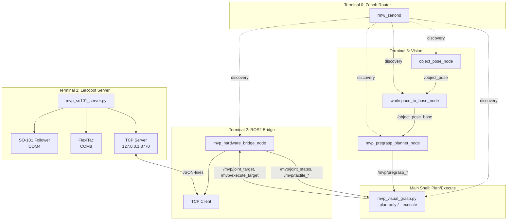
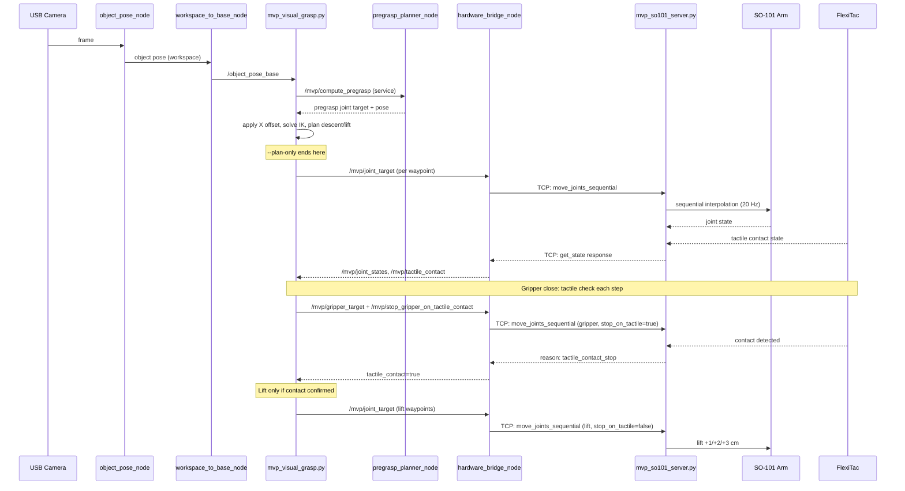

# SO-101 Visual-Tactile Grasp — System Architecture

## Overview

The system is split across two Python environments communicating over localhost TCP:

```
┌─────────────────────────────────┐      ┌──────────────────────────────┐
│    ROS2 Lyrical (Pixi)          │ TCP  │   LeRobot (Conda)             │
│    rmw_zenoh_cpp                │:8770 │                               │
│                                 │◄────►│   mvp_so101_server.py         │
│  ┌─ object_pose_node            │      │   ├─ COM4 → SO-101 arm        │
│  ├─ workspace_to_base_node      │      │   ├─ COM8 → FlexiTac tactile  │
│  ├─ mvp_pregrasp_planner_node   │      │   └─ TCP server (single cli)  │
│  ├─ mvp_hardware_bridge_node ───┼──────┤                               │
│  └─ mvp_visual_grasp.py         │      └──────────────────────────────┘
│     (no direct TCP)             │
└─────────────────────────────────┘
```

See [README.md](../README.md) for the high-level Mermaid diagram.

---

## Process Architecture



## Data Flow



---

## ROS2 Nodes

### Active MVP Nodes

| Node | Package | Role |
|------|---------|------|
| `object_pose_node` | `so101_object_perception` | ArUco marker detection → workspace pose |
| `workspace_to_base_node` | `so101_frame_transform` | Workspace → base_link coordinate transform |
| `mvp_pregrasp_planner_node` | `so101_mvp_control` | Compute pregrasp joint target from object pose |
| `mvp_hardware_bridge_node` | `so101_mvp_control` | TCP client to LeRobot server; publishes state, forwards targets |
| `mvp_visual_grasp` | (script, not package) | Integrated grasp planner/executor; ROS2 node for plan-only / execute |

### Legacy Nodes (not in MVP chain)

| Node | Package | Status |
|------|---------|--------|
| `command_gate_node` | `so101_command_gate` | Archived — command validation with gate tokens |
| `shadow_executor_node` | `so101_command_gate` | Archived — dry-run preview execution |
| `connection_trajectory_node` | `so101_command_gate` | Archived — safety envelope around current-to-plan connection |
| `timed_trajectory_node` | `so101_trajectory_safety` | Archived — time-parameterized trajectory with heartbeats |
| `tcp_bridge_node` | `so101_robot_bridge` | Archived — legacy bridge (port 8765, protocol v1) |
| `fk_node` | `so101_kinematics` | Archived — FK verification node |
| `visual_grasp_planner_node` | `so101_grasp_planner` | Archived — original grasp planner (before MVP-4 refactor) |

---

## Key ROS2 Topics

### Published by Bridge (from LeRobot server)

| Topic | Type | Description |
|-------|------|-------------|
| `/mvp/joint_states` | `JointState` | Current arm joint positions (5 joints) |
| `/mvp/gripper_state` | `Float64` | Current gripper position (LeRobot units) |
| `/mvp/tcp_connected` | `Bool` | TCP connection to server alive |
| `/mvp/tcp_status` | `String` | TCP status messages |
| `/mvp/tactile_ready` | `Bool` | Tactile sensor initialized and streaming |
| `/mvp/tactile_contact` | `Bool` | Contact detected (confirmed) |
| `/mvp/tactile_score` | `Float64` | Current top-20 mean delta score |
| `/mvp/tactile_status` | `String` | Tactile status messages |

### Published by Vision Pipeline

| Topic | Type | Description |
|-------|------|-------------|
| `/object_pose_base` | `PoseStamped` | Object pose in base_link frame |

### Published by Pregrasp Planner

| Topic | Type | Description |
|-------|------|-------------|
| `/mvp/pregrasp_joint_target` | `JointState` | Computed pregrasp joint positions |
| `/mvp/pregrasp_pose` | `PoseStamped` | Pregrasp end-effector pose |
| `/mvp/pregrasp_valid` | `Bool` | Whether pregrasp is valid |
| `/mvp/pregrasp_status` | `String` | Pregrasp status messages |

### Subscribed by Bridge (targets from visual_grasp)

| Topic | Type | Description |
|-------|------|-------------|
| `/mvp/joint_target` | `JointState` | Arm joint target position |
| `/mvp/gripper_target` | `Float64` | Gripper target position |
| `/mvp/stop_gripper_on_tactile_contact` | `Bool` | Enable tactile-contact stop during gripper motion |

### Services

| Service | Provider | Consumer | Description |
|---------|----------|----------|-------------|
| `/mvp/compute_pregrasp` | `pregrasp_planner_node` | `mvp_visual_grasp.py` | Request pregrasp computation |
| `/mvp/execute_target` | `hardware_bridge_node` | `mvp_visual_grasp.py` | Request target execution |

---

## TCP Protocol

The TCP communication between the bridge and server uses a simple JSON-lines protocol:

- **Server**: `mvp_so101_server.py` binds `127.0.0.1:8770`, accepts exactly one client
- **Client**: `MvpTcpClient` (in `so101_mvp_control` / `shared_protocol`) is the sole persistent client
- **Format**: One JSON object per line, terminated by `\n`
- **Commands**: `get_state`, `move_joints_sequential` (with `confirm: "MVP_MOVE"`)
- **Motion confirmation**: `"MVP_MOVE"` string required in every motion command
- **Tactile stop flag**: `stop_gripper_on_tactile_contact` boolean in `move_joints_sequential`

No heartbeat negotiation, no plan IDs, no trajectory hashes. The protocol is intentionally minimal.

---

## Perception Data Flow

1. `object_pose_node` captures camera frame, detects ArUco marker, publishes pose in **workspace** frame
2. `workspace_to_base_node` applies the calibrated `workspace → base_link` transform, publishes `/object_pose_base`
3. `mvp_visual_grasp.py` subscribes to `/object_pose_base`, validates freshness, and freezes the pose for the current grasp attempt

Once frozen, the pose is not re-fetched. The entire trajectory (pregrasp, descent, lift) is planned from this single frozen pose.

---

## Grasp Planning (`mvp_visual_grasp.py`)

### Coordinate Correction

After receiving the object pose, a forward X offset is applied:

```python
# grasp_x_offset_m from config/mvp_hardware.json (default: +0.020)
object_pose_base_x += grasp_x_offset_m  # +X = forward / away from robot base
```

This offset is:
- Applied **once** at the grasp target generation layer
- Inherited by the **entire** trajectory (pregrasp, descent, grasp, lift)
- The original `/object_pose_base` value is **not modified**

### Pregrasp Planning

1. Call `/mvp/compute_pregrasp` service
2. Receive pregrasp joint target and end-effector pose
3. Validate joint contract (5 joints, correct names), URDF joint limits, and motion deltas against current state
4. If validation fails, attempt IK multiseed fallback with different seed configurations

### Descent Planning

- 7 Cartesian waypoints from pregrasp Z down to grasp Z
- Total descent: 0.07 m (configurable in `config/mvp_grasp.yaml`)
- Each waypoint solved with IK (damped least-squares)
- Snapshots frozen before motion begins; no live vision updates during descent

### Lift Planning

- 3 waypoints: +0.01 m, +0.02 m, +0.03 m from grasp Z
- X and Y unchanged from corrected grasp position
- Orientation unchanged throughout
- Only executed if tactile contact is confirmed

---

## FK/IK (`so101_mvp_kinematics`)

### Forward Kinematics

- Parses the frozen URDF (`data/robot_model/so101/so101_new_calib.urdf`) at import time
- Kinematic chain: `base_link` → `shoulder_pan` → `shoulder_lift` → `elbow_flex` → `wrist_flex` → `wrist_roll` → `gripper_frame_link`
- Uses DH-like transforms derived from URDF joint origins and axes
- Returns end-effector position and orientation (as rotation matrix)

### Inverse Kinematics

- Damped least-squares (DLS) position IK
- Target: end-effector position matches target, Z-axis (gripper direction) points downward
- Jacobian: geometric Jacobian (5 columns for 5 arm joints)
- Joint limit clamping within each iteration
- Multiseed fallback: tries current joint state, mid-range, and random seeds
- Solution quality metrics: position error (m), approach angle error (deg)

---

## Tactile Close Loop

### FlexiTac Integration

- Direct serial: COM8, 2,000,000 baud
- 12 rows × 32 columns tactile array
- Baseline: 30 frames captured at startup (do not touch sensor during baseline)
- Frame difference scoring: top-20 mean delta per frame
- Contact threshold: 40.0 (on), 30.0 (off) — with hysteresis
- Confirm frames: 3 consecutive above threshold = contact confirmed
- Release frames: 5 consecutive below threshold = contact released
- State freshness: max 0.25 s age considered valid

### Gripper Close Logic

The final close algorithm:

1. Gripper starts at `g0` (current position before close)
2. First, open gripper slightly: `g0 → g0 + 10` (to ensure clearance)
3. Then, incrementally close: step = 2.0 per tick
4. After each step, check tactile state:
   - If `tactile_contact == true` → **STOP immediately** (primary termination)
   - If gripper position reaches `g0 + safe_close_limit` (5.0) without contact → **STOP** (secondary termination)
5. `g0` is **NOT** the final close limit — the gripper can close past `g0` if no contact is detected
6. `preload`: 0 (no preload tension after contact stop)
7. **Stall detection**: diagnostic only; does NOT count as grasp success

### Lift Gate

After gripper close:
- If `tactile_contact_confirmed == true` → execute 3-segment lift
- If `tactile_contact_confirmed == false` → **NO LIFT** (arm stays in place)
- During lift: monitor tactile contact; if contact is lost → **ABORT lift immediately**
- Lift success requires contact maintained throughout all 3 segments

---

## Safety Behavior

1. **Plan-only gate**: No motion command is sent without `--plan-only` passing first
2. **Manual confirmation**: `--confirm VISUAL_GRASP` must be explicitly typed
3. **Motion timeout**: Each `move_joints_sequential` has a timeout (default 5.0 s)
4. **Tracking error abort**: If any joint deviates > 8.0° from target, motion aborts (3 strikes)
5. **Joint limit enforcement**: IK solutions clamped to URDF limits; server-side calibration range checks
6. **No automatic retry**: After any error, timeout, or disconnect, the system does NOT retry
7. **No automatic return/place**: The arm stays at its last position after grasp/lift
8. **Physical power cutoff**: Always accessible; recommended as ultimate stop mechanism

---

## Final X-Axis Compensation

The SO-101 in the validated setup exhibited a systematic ~2 cm rearward grasp bias. Investigation confirmed:

- **Direction**: The arm was grasping behind the visual target
- **base_link convention**: `+X` = forward / away from robot base
- **Fix**: `grasp_x_offset_m = +0.020` in `config/mvp_hardware.json`
- **Application point**: Applied once in `mvp_visual_grasp.py run()`, after receiving object pose, before planning
- **Inheritance**: All subsequent planning (pregrasp Z, descent Z-waypoints, grasp, lift Z-waypoints) inherits the corrected X
- **What is NOT modified**: `/object_pose_base` raw value, Y coordinate, Z coordinate, orientation

This is an empirical per-setup calibration value. It should be verified and adjusted for each physical setup.

---

## Legacy Components

The repository retains several legacy packages and scripts from earlier development stages. These are preserved for engineering reference but are NOT part of the current MVP chain:

- `ros2_ws/src/so101_command_gate/` — Full command gate, shadow executor, connection trajectory system
- `ros2_ws/src/so101_trajectory_safety/` — Timed trajectory parameterization and validation
- `ros2_ws/src/so101_kinematics/` — FK verification node
- `ros2_ws/src/so101_grasp_planner/` — Original grasp planner node
- `ros2_ws/src/so101_robot_bridge/` — Legacy TCP bridge (port 8765)
- `scripts/launch_mvp4e_system.ps1` — Complex one-launch orchestrator (DEPRECATED)
- `scripts/run_mvp4e_bridge.ps1` — Dedicated bridge runner (DEPRECATED)
- `lerobot_server/mock_hardware_server.py` — Mock hardware server for testing

See `docs/LEGACY_COMPONENTS.md` for the full inventory with rationale for each component's archival.
